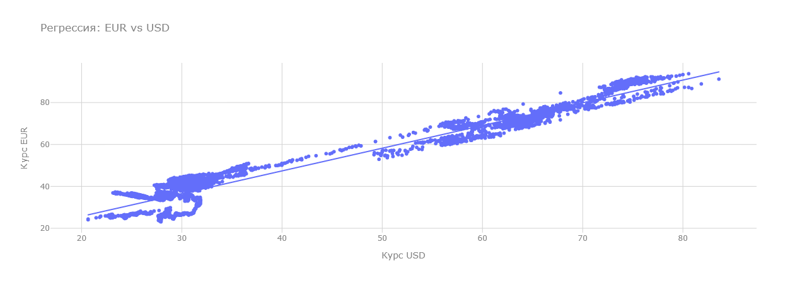
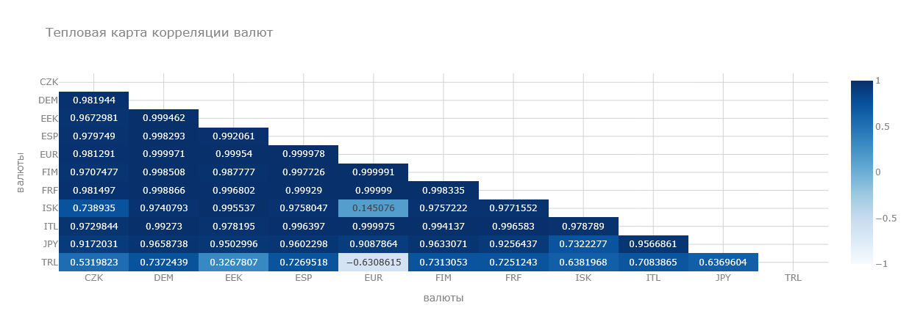
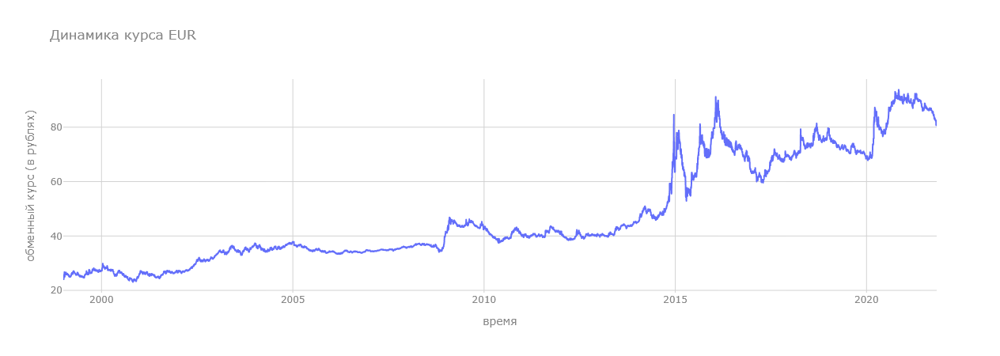
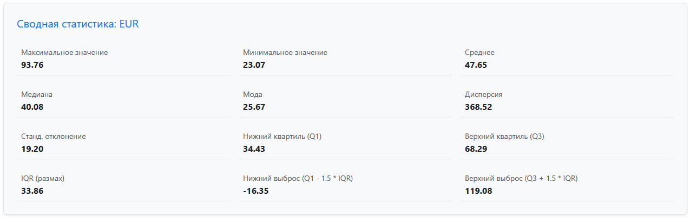
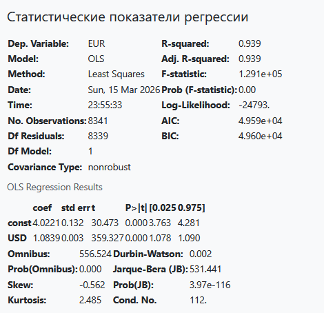

Сайт, предназначеный для анализа курсов валют, визуализации тепловых карт, графиков распределения, а также зависимостей валют.

  Стройте карты регрессий.

  

  Тепловые карты.

  

  А также получайте подробную информацию о распределении курсов валют относительно рубля на основе оффициальных данных.

  

  Просматривайте статистические данные.

  

  И регрессионные данные на основе scyPy.

  

ссылка для доступа к сайту:<https://denisbuhner.pythonanywhere.com/>
